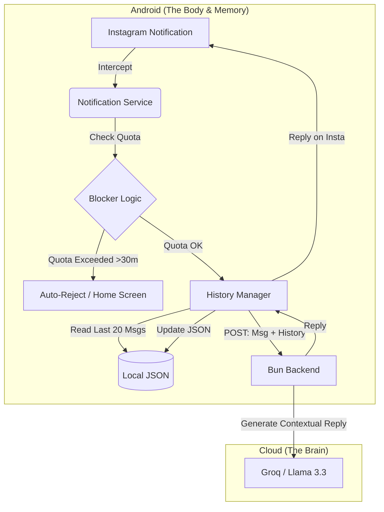

# PIM (Personal Intelligence Module)

> **"My digital twin. An AI system that handles my DMs so I don't have to."**

 

## 🧐 The Mission
PIM is an automated proxy designed to bridge the gap between my social obligations and my need for deep work. It lives on my Android phone, intercepts Instagram notifications, and uses an LLM to generate context-aware replies that sound exactly like me.

It’s not a chatbot. It’s a **Personal Intelligence Module**.

## 📜 The Manifesto
This project follows a simple rule: **Utility > Perfection.**

> *"When you build for yourself, 'Done' is better than 'Perfect.' If the code is messy but it saves you 10 minutes a day, it’s good code. We optimize for utility, not for a code review."*

PIM isn't built to be sold. It's built to solve a specific problem in my life, using whatever tools get the job done fastest.

---

## 🛠️ Tech Stack

| Layer | Technology |
|-------|------------|
| **Mobile** | Android · Kotlin · Jetpack Compose |
| **Backend** | Bun · TypeScript · ElysiaJS (Stateless) |
| **AI** | Groq · Llama 3.3 70B (3-key rotation) |
| **Local Storage** | JSON file (history) · Room DB (UI) |
| **Guardian** | AccessibilityService · UsageStats (Doom Scroll Blocker) |
| **Deployment** | Render · Docker |

---

## 🏗️ Architecture: Local-First & Stateless

The memory lives in your pocket. The backend is a pure intelligence engine.



---

## ✨ Features

- **🔄 Seamless Integration** — Works silently in the background, no manual intervention needed
- **🧠 Context-Aware Replies** — Last 20 messages bundled from local storage for coherent responses
- **🛡️ Smart Safeguards** — Cooldown timers, duplicate detection, self-reply prevention
- **🔑 Key Rotation** — Automatic failover across 3+ Groq API keys for reliability
- **📱 Local-First** — All conversation history stored on-device, backend stores nothing
- **🚫 Doom Scroll Blocker** — Instagram blocked after 30 min/day via AccessibilityService
- **⏰ Daily Reset** — Usage quota resets at 4:30 AM IST via WorkManager

---

## 📁 Project Structure

```
PIM/
├── app/                # Main Android application (Kotlin + Compose)
│   └── src/main/java/com/example/pim_main/
│       ├── api/PimApi.kt              # Backend API client
│       ├── history/HistoryManager.kt  # Local JSON history (The Memory)
│       ├── service/
│       │   ├── PimNotificationService.kt  # Instagram DM interceptor
│       │   ├── PimForegroundService.kt    # Keep-alive service
│       │   └── AppBlockerService.kt       # Doom Scroll Blocker
│       ├── worker/
│       │   ├── BackendKeepAliveWorker.kt  # Ping backend
│       │   └── QuotaResetWorker.kt        # Daily quota reset
│       ├── data/                          # Room DB for UI
│       └── ui/                            # Compose screens
├── backend/            # Stateless Brain (Bun + Elysia)
│   └── src/
│       ├── index.ts    # API routes (POST /chat with history[])
│       └── llm.ts      # Groq integration + System Prompt V4.0
├── Dockerfile
└── render.yaml         # Deployment config
```

---

## 🚀 Quick Start

```bash
# Backend setup
cd backend
bun install
bun run dev

# Test it
curl -X POST http://localhost:3000/chat \
  -H "Content-Type: application/json" \
  -d '{"sender":"test","message":"bro kya scene h","history":[]}'

# Android — Open /app in Android Studio and run on device
```

---

## 📄 License

**MIT License** — Do whatever you want with it, just don't blame me.

Cheers ☕

---

<br>

**[⬆ Back to Top](#pim--personal-intelligence-module)**
