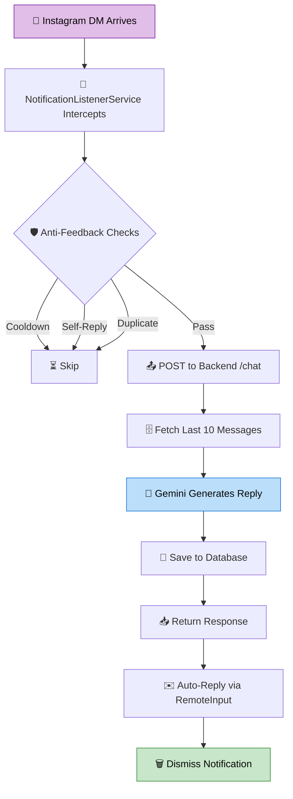

# PIM (Personal Intelligence Module)

> **"My digital twin. An AI system that handles my DMs so I don't have to."

 

## 🧐 The Mission
PIM is an automated proxy designed to bridge the gap between my social obligations and my need for deep work. It lives on my Android phone, intercepts Instagram notifications, and uses an LLM to generate context-aware replies that sound exactly like me.

It’s not a chatbot. It’s a **Personal Intelligence Module**.

## 📜 The Manifesto
This project follows a simple rule: **Utility > Perfection.**

> *"When you build for yourself, 'Done' is better than 'Perfect.' If the code is messy but it saves you 10 minutes a day, it’s good code. We optimize for utility, not for a code review."*

PIM isn't built to be sold. It's built to solve a specific problem in my life, using whatever tools get the job done fastest.

---

## 🛠️ Tech Stack

| Layer | Technology |
|-------|------------|
| **Mobile** | Android · Kotlin · NotificationListenerService |
| **Backend** | Bun · TypeScript · ElysiaJS |
| **Database** | PostgreSQL · Drizzle ORM |
| **AI** | Google Gemini (5-key rotation) |
| **Deployment** | Render · Docker |

---

## 🏗️ How It Works



---

## ✨ Features

- **🔄 Seamless Integration** — Works silently in the background, no manual intervention needed
- **🧠 Context-Aware Replies** — Fetches conversation history for coherent responses  
- **🛡️ Smart Safeguards** — Cooldown timers, duplicate detection, self-reply prevention
- **🔑 Key Rotation** — Automatic failover across 5 API keys for reliability
- **📊 Message Logging** — Full conversation history stored in PostgreSQL

---

## 📁 Project Structure

```
PIM/
├── android/          # Android notification interceptor (Kotlin)
├── app/              # Main Android application
├── backend/          # TypeScript backend (ElysiaJS + Drizzle)
│   ├── src/
│   │   ├── index.ts  # API routes
│   │   ├── llm.ts    # Gemini integration
│   │   └── db/       # Database connection
│   └── drizzle/      # Schema & migrations
├── Dockerfile
└── render.yaml       # Deployment config
```

---

## 🚀 Quick Start

```bash
# Clone the repository
git clone https://github.com/TechTitan360/pim.git

# Backend setup
cd backend
bun install
bun run dev

# Android
# Open /android in Android Studio and run on device
```

---

## 📄 License

**MIT License** — Do whatever you want with it, just don't blame me.

Cheers ☕

---

<br>

**[⬆ Back to Top](#pim--personal-intelligence-module)**
